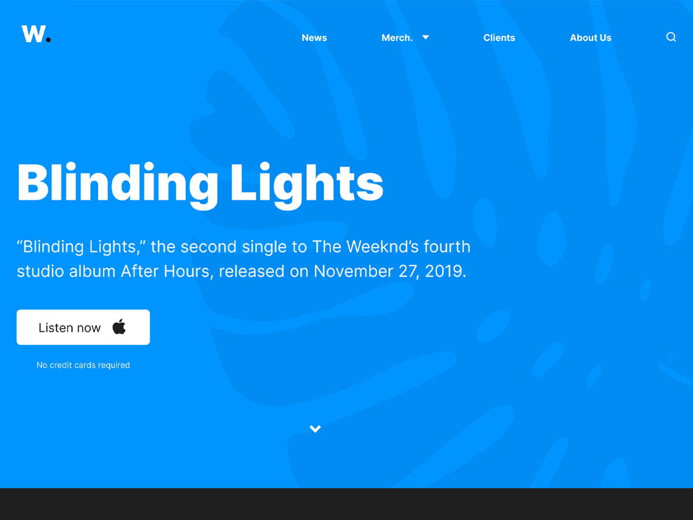

# "Blinding Lights" - iDeals Test task
[](http://2483359.dglance.web.hosting-test.net/)

*This is a [Test task](wordpress-developer-test-task.pdf) for the position of [WordPress Developer](https://djinni.co/jobs/484393-wordpress-developer/) ([iDeals](https://ideals.jobs/))* <br/>
It lives at ---> [<b>DEMO</b>](http://2483359.dglance.web.hosting-test.net/)

---

## About
This test task is a simulation of real work on creating a custom theme for WordPress, which will allow you to demonstrate your knowledge and skills in such skills as WordPress, PHP, JavaScript, HTML, CSS, MySQL, etc. In addition, completing this test will help you better understand the essence and content of the work in our company as a WordPress Developer
## Task
Create your own clean custom WordPress theme based on the [design](https://www.figma.com/file/mIjzWavmG8yujyy77wyd8x/Test-Task-(WP-Developer)-(Copy)-(Copy)).
## Implementation
<ul>
<li>According to the terms of the task, a clean WordPress theme was created. To compile JS and SCSS preprocessor styles, I use the Webpack module assembler.</li>
<li>I connect the Bootstrap SCSS components to the project - I only use the grid and some mixins.</li>
<li>According to the design, I define global variables for theme colors, describe global elements of typography, buttons, etc.</li>
<li>I connect the main site font from the Google Fonts service asynchronously.</li>
<li>For icons, I use a custom font created by the fontello service.</li>
<li>To implement a block with a slider, I use the slick carousel library.</li>
<li>In my theme, I register two theme locations for displaying the menu.</li>
<li>Also adding some custom sizes for the images.</li>
<li>I am registering a custom post type for client logos. The single page of this post type redirect to the main page.</li>
<li>Registering a sidebar for displaying widgets on blog pages.</li>
<li>I am adding a function for pagination of archive pages.</li>
<li>I am creating a custom category for my Gutenberg blocks.</li>
<li>To implement the blocks, I use the capabilities of the ACF Pro plugin.</li>
<li>I developed a custom solution for the sticky functionality for the main menu.</li>
<li>The News menu item leads to a separate blog page, the rest of the items are anchor links to the main page blocks. Merch submenu items scroll to the block of the same name and switch the carousel to the corresponding slide.</li>
<li>A custom mobile menu has been implemented.</li>
<li>Created some web animations to decorate the site.</li>
<li>The desktop version of the site is designed with maximum compliance with the layout design.</li>
<li>Responsiveness of the site is done at my own discretion.</li>
<li>Two working days were spent on the entire development.</li>
</ul>

---

## Get started

To run Webpack  -install the dependencies...<br/>
<b>node</b> - v14.17.3<br/>
<b>npm</b> - 6.14.13


```bash
npm install
```

## To start

...as `dev` mode:

```bash
npm run dev
```

...as `build` mode:

```bash
npm run build
```
